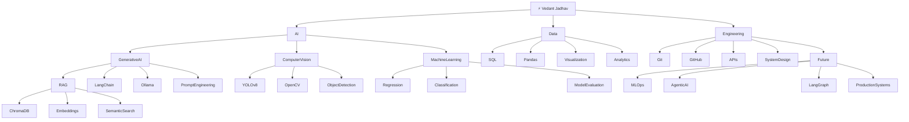
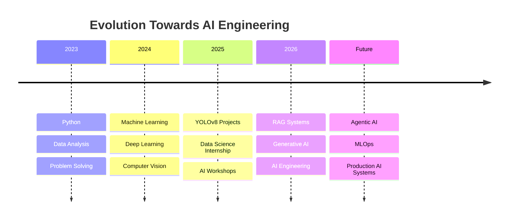

<div align="center">


</div>

# 🖥️ COMMAND CENTER

```text
╔══════════════════════════════════════════════════════════════╗
║                      VEDANT JADHAV                           ║
╠══════════════════════════════════════════════════════════════╣
║ Role        : AI Engineer in Progress                        ║
║ Degree      : BE Artificial Intelligence & Data Science      ║
║ Location    : Nashik, Maharashtra, India                     ║
║ Focus       : Generative AI • Computer Vision • ML           ║
║ Building    : Intelligent Systems & AI Applications          ║
║ Learning    : MLOps • Agentic AI • Production AI             ║
║ Mission     : Transform Data into Intelligence               ║
║ Status      : Shipping Projects & Learning Daily             ║
╚══════════════════════════════════════════════════════════════╝
```

---

# 🧠 KNOWLEDGE GRAPH



---

# 🗺️ MY LEARNING JOURNEY



---

# 🛠️ TECH ECOSYSTEM

### Languages


### AI & Machine Learning


### Generative AI


### Data


---

# ⚙️ FEATURED SYSTEMS

## 🤖 AI-Powered RAG Assistant

```yaml
Problem:
  Querying documents efficiently

Stack:
  LangChain
  ChromaDB
  Ollama
  Python

Features:
  Semantic Search
  Local LLM Integration
  Context Aware Responses
  Zero API Cost
```

🔗 Repository: [Agent-V450/Local-RAG-System](https://github.com/Agent-V450/Local-RAG-System)

---

## 🏍️ Two-Wheeler Detection System

```yaml
Problem:
  Real-time traffic monitoring

Stack:
  YOLOv8
  OpenCV
  Python

Features:
  Object Detection
  Video Processing
  Real-time Inference
  Dataset Annotation Pipeline
```

🔗 Repository: [Agent-450/Two-Wheeler-Detection](https://github.com/Agent-V450/two-wheeler-detection)

---

## 📊 Diwali Sales Analysis

```yaml
Problem:
  Understanding customer behaviour

Stack:
  Python
  Pandas
  NumPy
  Matplotlib

Features:
  Data Cleaning
  Exploratory Data Analysis
  Customer Segmentation
  Trend Visualization
```

🔗 Repository: [Agent-V450/Diwali-Sales-Analysis](https://github.com/Agent-V450/Diwali-Sales-Analysis)

---

# 🎯 BUILDING IN PUBLIC

```text
☑ Data Science Internship

☑ AI Workshop Host

☑ RAG Assistant

☑ Computer Vision Projects

☑ GitHub Portfolio

☐ Production AI Deployment

☐ LangGraph Agents

☐ MLOps Pipeline

☐ Open Source Contributions

☐ Research Publication
```

---

# 📈 GITHUB ANALYTICS

<div align="center">


</div>

---

# 🤝 LET'S CONNECT

<div align="center">

<a href="https://linkedin.com/in/vedaaaannt">
  
</a>
&nbsp;&nbsp;&nbsp;&nbsp;
<a href="https://github.com/Agent-V450">
  
</a>
&nbsp;&nbsp;&nbsp;&nbsp;
<a href="mailto:vedaaaannt@gmail.com">
  
</a>
&nbsp;&nbsp;&nbsp;&nbsp;


#### "The future belongs to those who build."

<sub>
</div>
